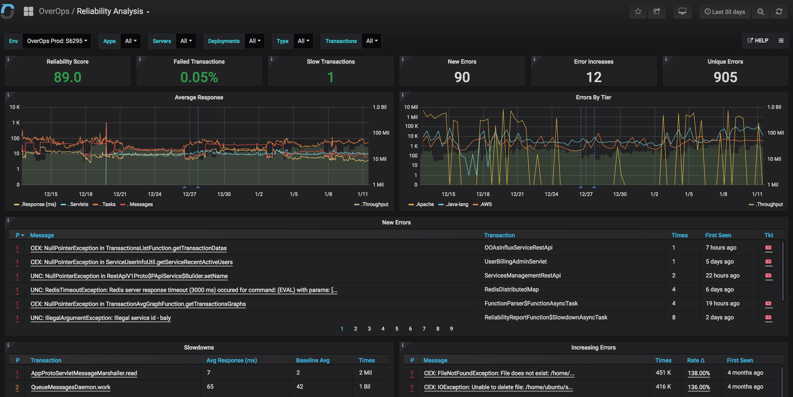
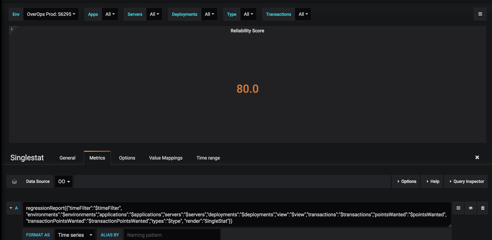
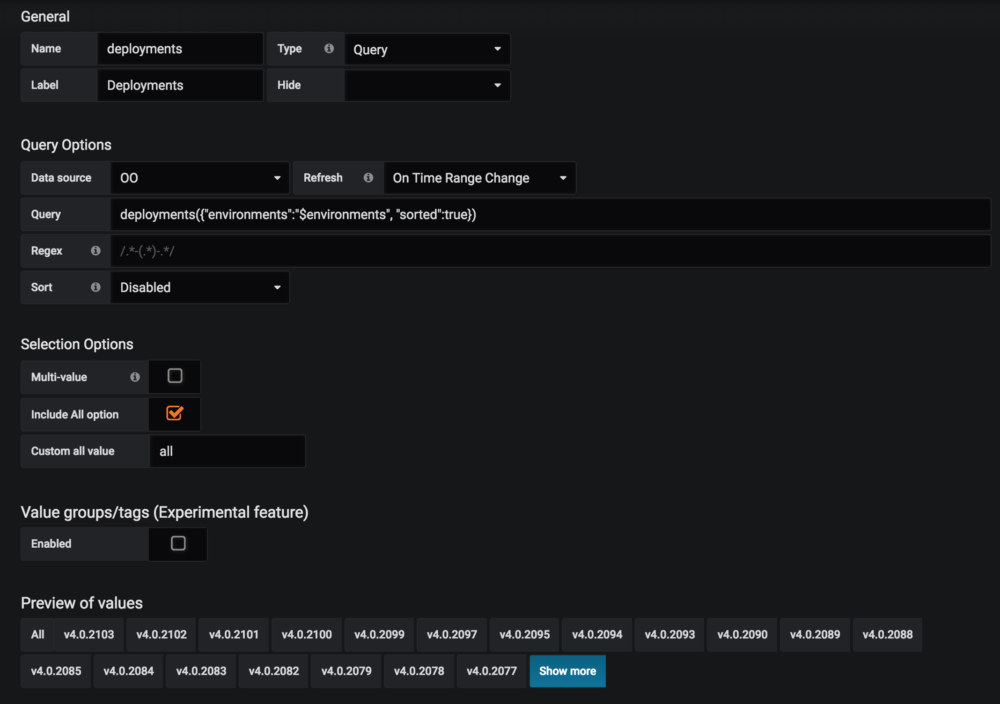

# OverOps Influx Backend

The goal of this project is to enable [Grafana](https://grafana.com/) to visualize [OverOps](https://www.overops.com) event data and time-series metrics.



## Table of Contents

[Background](#background)  
&nbsp;&nbsp;&nbsp;&nbsp; [Influx Samples](#influx-samples)  
[OverOps Influx Backend Project](#overops-influx-backend-project)  
&nbsp;&nbsp;&nbsp;&nbsp; [Functions](#functions)  
&nbsp;&nbsp;&nbsp;&nbsp;&nbsp;&nbsp;&nbsp;&nbsp; [Regression Report](#regression-report)  
&nbsp;&nbsp;&nbsp;&nbsp;&nbsp;&nbsp;&nbsp;&nbsp; [Deployments](#deployments)  
[Setup](#setup)  
[Support](#support)  
[License](#license)

## Background

Grafana supports several data sources, including [InfluxDB](http://docs.grafana.org/features/datasources/influxdb/).

The [InfluxDB REST API](https://docs.influxdata.com/influxdb/v1.7/tools/api/) responds to SQL-like requests with a JSON object containing an array of series.  Each series has multiple values and a timestamp.

### Influx Samples

Input:

```bash
curl -G 'http://localhost:8086/query?pretty=true' \
  --data-urlencode "db=mydb" \
  --data-urlencode "q=SELECT \"value\"
                      FROM \"cpu_load_short\"
                      WHERE \"region\"='us-west'"
```

Output:

```json
{
  "results": [
    {
      "statement_id": 0,
      "series": [
        {
          "name": "cpu_load_short",
          "columns": [
            "time",
            "value"
          ],
          "values": [
            [
              "2015-01-29T21:55:43.702900257Z",
              2
            ]
          ]
        }
      ]
    }
  ]
}
```

## OverOps Influx Backend Project

In order to utilize the power of Grafana+Influx, this project introduces and parses a new query language.

The solution has two components:

1. A Java REST endpoint that works as an Influx `/query` API. This allows Grafana to use OverOps as a data source. Configuration files for Grafana are located in the [datasources](/grafana/conf/provisioning/datasources) folder.
2. A set of Grafana dashboards that use a special query language in order to fetch OverOps related metrics. The dashboards json files are located in the [dashboards](grafana/conf/provisioning/dashboards/overops) folder.

The project is bundled as part of the OverOps API Server, and can be run separately as a spring-boot uber jar.

### Functions

Function inputs are defined in the [input](/src/main/java/com/takipi/integrations/grafana/input) folder. Function inputs define our query language, which is used by Grafana to retrieve data to render dashboards. *Inputs are thoroughly documented, including examples and screenshots.*

The functions themselves are in the [functions](src/main/java/com/takipi/integrations/grafana/functions) folder. The functions heavily utilize the [OverOps API Client](https://github.com/takipi/api-client) and [REST APIs](https://doc.overops.com/reference) to retrieve data from the OverOps API Server.

Outputs are in the [output](src/main/java/com/takipi/integrations/grafana/output) folder. The data is assembled and output as a JSON object resembling the output of the InfluxDB REST API, allowing for consumption by Grafana.

Let's look at two example functions: Regression Report and Deployments.

#### Regression Report

This function returns a report for a a target set of applications, deployments or tiers (i.e. categories) listing an possible new errors, increases (i.e. regressions) and slowdowns.

[Input source code](src/main/java/com/takipi/integrations/grafana/input/RelabilityReportInput.java)  
[Function source code](/src/main/java/com/takipi/integrations/grafana/functions/ReliabilityReportFunction.java)  
[Output source code](/src/main/java/com/takipi/integrations/grafana/output/Series.java)



Template:

```bash
regressionReport({"timeFilter":"$timeFilter","
  environments":"$environments",
  "applications":"$applications",
  "servers":"$servers",
  "deployments":"$deployments",
  "view":"$view",
  "pointsWanted":"$pointsWanted",
  "transactionPointsWanted":"$transactionPointsWanted"
  "types":"$type",
  "render":"Grid",
  "mode":"Tiers",
  "limit":"$limit",
  "sevAndNonSevFormat":"%d (%d p1)",
  "sevOnlyFormat":"%d p1"})
```

Live:

```bash
curl -G 'http://localhost:8086/query?pretty=true' \
  --data-urlencode "db=mydb" \
  --data-urlencode "q=regressionReport({
    "timeFilter":"time >= now() - 7d",
    "environments":"(Prod: S1234)",
    "applications":"all",
    "servers":"all",
    "deployments":"all",
    "view":"All Events",
    "pointsWanted":"24", "transactionPointsWanted":"100",
    "types":"all",
    "render":"Grid",
    "mode":"Deployments",
    "limit":"10",
    "sevAndNonSevFormat":"%d (%d p1)",
    "sevOnlyFormat":"%d p1"})
```

Output:

```json
{
  "results": [{
    "statement_id": 0,
    "series": [{
      "name": "events",
      "columns": ["from", "to", "timeRange", "Service", "Key", "Name", "NewIssues", "Regressions", "Slowdowns", "NewIssuesDesc", "RegressionsDesc", "SlowdownsDesc", "Score", "ScoreDesc"],
      "values": [
        ["now-7d", "now", "7d", "S1234", "v4.0.2113", "v4.0.2113", 10, "2 p1", "3  (2 p1)", "SocketTimeoutException in CryptoProto$PEncryptedData, ClientAbortException in ParallaxTimerProto$PParallaxTimerData, Logged Warning in RestApiTokenUtil\nand 7 more", "+39% Logged Error in JarClassBytesRetriever$ZeusonV1Retriever, +87% Logged Warning in BackendSourceCodeProcessor", "+289% GracefulTask, +280% QueueMessagesDaemon, +234% FunctionParser$FunctionAsyncTask", 52.5, "100 - (10 new issues + 2 severe error increases * 2 + 1 slowdown + 2 severe slowdowns * 2) * 2.5, avg over 1 days \u003d 52.5. Weights are defined in the Settings dashboard.", "v4.0.2113 over . 1 day agoNew errors: SocketTimeoutException in CryptoProto$PEncryptedData, ClientAbortException in ParallaxTimerProto$PParallaxTimerData, Logged Warning in RestApiTokenUtil\nand 7 moreIncreasing Errors: +39% Logged Error in JarClassBytesRetriever$ZeusonV1Retriever, +87% Logged Warning in BackendSourceCodeProcessorSlowdowns: +289% GracefulTask, +280% QueueMessagesDaemon, +234% FunctionParser$FunctionAsyncTask"],
      ]
    }]
  }]
}
```

#### Deployments

This function returns the list of active deployments within the target environments  

[Input source code](src/main/java/com/takipi/integrations/grafana/input/DeploymentsInput.java)  
[Function source code](src/main/java/com/takipi/integrations/grafana/functions/DeploymentsFunction.java)  
[Output source code](/src/main/java/com/takipi/integrations/grafana/output/Series.java)



Template:

```bash
deployments({"environments":"$environments","sorted":"true"})
```

Live:

```bash
curl -G 'http://localhost:8086/query?pretty=true' \
  --data-urlencode "db=mydb" \
  --data-urlencode "q=deployments({  
    "environments":"Prod: S1234",  
    "sorted":"true"})
```

Output:

```json
{
  "results": [{
    "statement_id": 0,
    "series": [{
      "name": "events",
      "columns": ["key", "value"],
      "values": [
        ["key", "v4.0.2118"],
        ["key", "v4.0.2115"]
      ]
    }]
  }]
}
```

## Setup

Follow [grafana/README.md](grafana/README.md) for more deployment options and setup instructions.

## Support

If you need support, contact us at [support@overops.com](mailto:support@overops.com).

## License

Copyright (c) OverOps Inc. All rights reserved.

Licensed under the [MIT](LICENSE) License.
